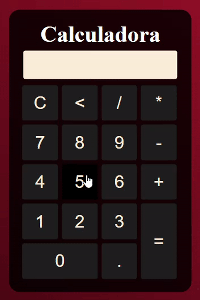

<h1>Calculadora</h1>

 &#160;&#160;
 &#160;&#160;
 &#160;&#160;

<h3>Descrição:</h3>

Projeto básico de um calculadora em JavaScript.

   

## Tecnologias e ferramentas:
  
 
 
  
  
  
  

  

<a href="https://lucasbizachi.github.io/calculadora/">calculadora</a>
 
